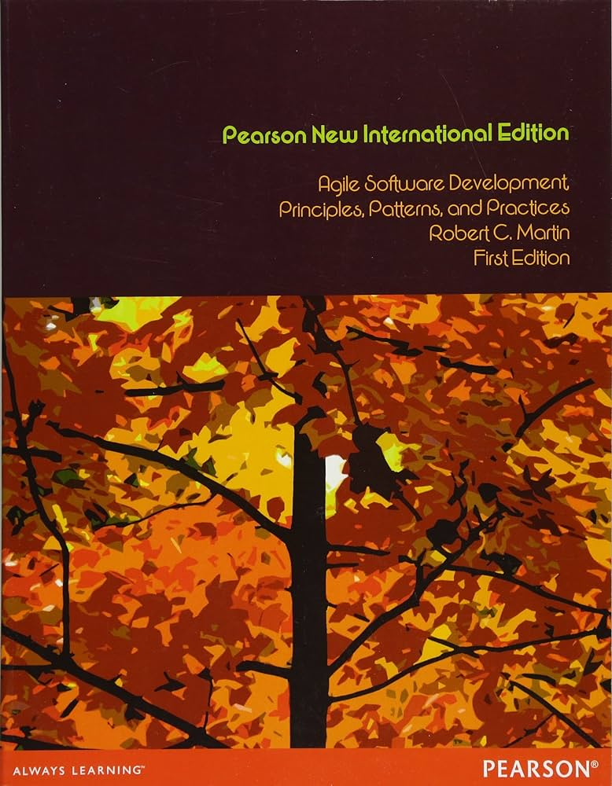
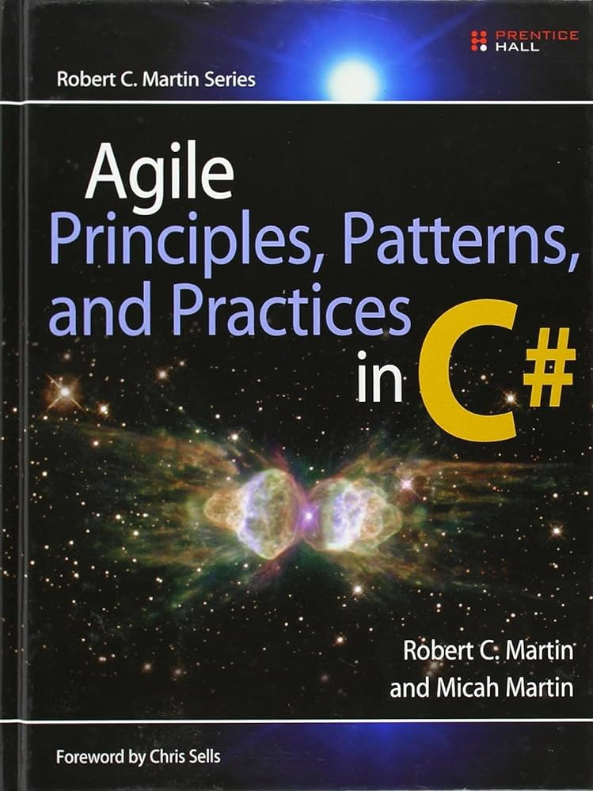

# Design Patterns in Python

This repository contains exercises and examples from the "Design Patterns in Python" course by Dmitri Nesteruk on Udemy.

## Course Information

- **Course Title**: Design Patterns in Python
- **Instructor**: Dmitri Nesteruk
- **Platform**: Udemy
- **Link**: [Design Patterns in Python](https://www.udemy.com/course/design-patterns-python/?couponCode=OF53124)

## Description

This repository contains exercises and examples from the "Design Patterns in Python" course by Dmitri Nesteruk, focusing on implementing creational, structural, and behavioral patterns in Python.

I am also studying the books 'Agile Software Development: Principles, Patterns, and Practices' and 'Agile Principles, Patterns, and Practices in C#' by Robert C. Martin as part of this course. I will be writing down key notes from these books under each relevant section.


|                   |  |
|:---------------------------------------------------------------:|:-------------------------------------------------------------------:|
| Agile Software Development: Principles, Patterns, and Practices |           Agile Principles, Patterns, and Practices in C#           |
 


### 1. SOLID Principles
- [X] Single Responsibility Principle (SRP)
- **Notes:**
    - **Definition:** A class should have only one reason to change. This means that a class should have only one job or responsibility.
    - **Rationale:** When a class has more than one responsibility, those responsibilities become coupled. A change to one responsibility could impair or inhibit the class's ability to meet the others. This results in a fragile design that is difficult to maintain and extend.
    - **Cohesion:** SRP promotes high cohesion within classes, where all methods and properties of a class are closely related to its primary responsibility. High cohesion makes the system more understandable and easier to maintain.
    - **Decoupling:** By adhering to SRP, you decouple code such that each class addresses a specific concern. This decoupling enhances the system's modularity, making it easier to understand, test, and refactor.
    - **Examples and Illustrations:** Martin provides concrete examples to illustrate how classes often end up with multiple responsibilities and how refactoring them according to SRP results in cleaner, more manageable code.
    - **Impact on Design:** Applying SRP can lead to more classes, but each class is simpler and more focused. This focus helps in isolating the impact of changes and improving code robustness.
    - **Connection to Other Principles:** SRP is foundational and interrelated with other SOLID principles (Open/Closed Principle, Liskov Substitution Principle, Interface Segregation Principle, Dependency Inversion Principle). Adherence to SRP helps in naturally aligning the design with these other principles.
    - **Real-World Application:** Martin emphasizes that in real-world applications, identifying the single responsibility of a class can sometimes be challenging. It requires thoughtful consideration of what constitutes a "responsibility" in the context of the software's domain and requirements.
    - By following SRP, developers can create systems that are more robust, easier to understand, and maintainable over time.

- [X] Open/Closed Principle (OCP)
- **Notes:**
    - **Definition:** Software entities (classes, modules, functions, etc.) should be open for extension but closed for modification. This means that the behavior of a module can be extended without modifying its source code.
    - **Rationale:** The principle aims to allow the system to be flexible and adaptable to changing requirements without altering existing code, thus reducing the risk of introducing bugs.
    - **Achieving OCP:**
      - Abstraction: Use abstractions (interfaces or abstract classes) to define stable points of extension.
      - Polymorphism: Use polymorphism to extend behaviors. New functionalities are added by creating new subclasses or implementing new classes that adhere to the existing abstractions.
      - Composition over Inheritance: Favoring composition over inheritance can also help achieve OCP by allowing new behaviors to be composed rather than modified.
    - **Examples:**
      - Shape Example: Martin uses the example of a `Shape` class with derived classes like `Circle` and `Square`. Instead of modifying the Shape class to add new shapes, new shape classes are created that extend the `Shape` interface.
      - Plugins: Many modern applications support plugins, which are a practical implementation of OCP. The core application remains unchanged while new features are added via plugins.
    - **Design Patterns:** Design patterns like Strategy, Command, and Decorator are commonly used to adhere to OCP by enabling new behaviors without changing existing code.
    - **Benefits:**
      - Maintainability: Enhances maintainability by reducing the risk of introducing errors when new features are added.
      - Reusability: Increases reusability of code components.
      - Flexibility: Provides flexibility in the face of changing requirements.
    - **Challenges**
      - Initial Design: Requires careful initial design to ensure that the correct abstractions are identified and implemented.
      - Over-Engineering: There is a risk of over-engineering, where too many abstractions are created in anticipation of future changes that may never occur.
    - **Relation to Other Principles:**
      - OCP is closely related to other SOLID principles. For example, adhering to the Liskov Substitution Principle helps in ensuring that subclasses can be used interchangeably with their base classes, which supports the goal of OCP.
    - By following the Open-Closed Principle, developers can create more robust and flexible systems that can evolve over time without the need for extensive modifications to existing code.
    
- [ ] Liskov Substitution Principle (LSP)
- [ ] Interface Segregation Principle (ISP)
- [ ] Dependency Inversion Principle (DIP)

### 2. Creational
- [ ] Builder
- [ ] Factories
  - [ ] Abstract Factory
  - [ ] Factory Method
- [ ] Prototype
- [ ] Singleton

### 3. Structural
- [ ] Adapter
- [ ] Bridge
- [ ] Composite
- [ ] Decorator
- [ ] Facade
- [ ] Flyweight
- [ ] Proxy

### 4. Behavioral
- [ ] Chain of Responsibility
- [ ] Command
- [ ] Interpreter
- [ ] Iterator
- [ ] Mediator
- [ ] Memento
- [ ] Observer
- [ ] State
- [ ] Strategy
- [ ] Template Method
- [ ] Visitor


## Getting Started

To get started with the exercises, clone this repository to your local machine:

```bash
git clone https://github.com/enavid/design-patterns-in-python-.git
cd design-patterns-python
